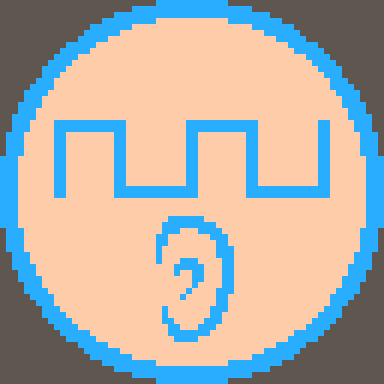
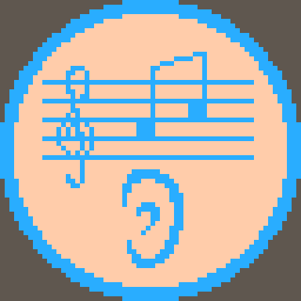
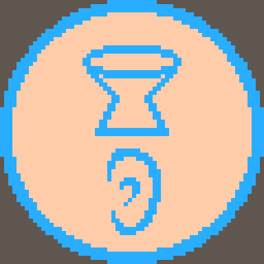

<table class="jop-noMdConv"><thead class="jop-noMdConv"><tr class="jop-noMdConv"><th class="jop-noMdConv"><h2>Regeln</h2></th><th class="jop-noMdConv"><h2>Badge</h2></th><th><h2>QR-Code</h2></th><th class="jop-noMdConv"><h2>Link</h2></th></tr></thead><tbody class="jop-noMdConv"><tr class="jop-noMdConv"><td class="jop-noMdConv">Regeln Musikraum</td><td class="jop-noMdConv"></td><td></td><td class="jop-noMdConv"><a title="https://fpiesik.github.io/gitschool/badges/Regeln" href="https://fpiesik.github.io/gitschool/badges/Regeln" class="jop-noMdConv">https://fpiesik.github.io/gitschool/badges/Regeln</a></td></tr><tr class="jop-noMdConv"><td class="jop-noMdConv"><h2 class="jop-noMdConv">Hören</h2></td><td class="jop-noMdConv"><h2>Badge</h2></td><td><h2>QR-Code</h2></td><td class="jop-noMdConv"><h2>Link</h2></td></tr><tr class="jop-noMdConv"><td class="jop-noMdConv">Klängehören I</td><td class="jop-noMdConv"></td><td></td><td class="jop-noMdConv"><a title="https://fpiesik.github.io/gitschool/badges/Kl%C3%A4ngeh%C3%B6ren_I" href="https://fpiesik.github.io/gitschool/badges/Kl%C3%A4ngeh%C3%B6ren_I" class="jop-noMdConv">https://fpiesik.github.io/gitschool/badges/Klängehören_I</a></td></tr><tr class="jop-noMdConv"><td class="jop-noMdConv">Tönehören I</td><td class="jop-noMdConv"></td><td></td><td class="jop-noMdConv"><a title="https://fpiesik.github.io/gitschool/badges/T%C3%B6neh%C3%B6ren_I" href="https://fpiesik.github.io/gitschool/badges/T%C3%B6neh%C3%B6ren_I" class="jop-noMdConv">https://fpiesik.github.io/gitschool/badges/Tönehören_I</a></td></tr><tr class="jop-noMdConv"><td class="jop-noMdConv">Rhythmenhören I</td><td class="jop-noMdConv"></td><td></td><td class="jop-noMdConv"><a title="https://fpiesik.github.io/gitschool/badges/Rhythmenh%C3%B6ren_I" href="https://fpiesik.github.io/gitschool/badges/Rhythmenh%C3%B6ren_I" class="jop-noMdConv">https://fpiesik.github.io/gitschool/badges/Rhythmenhören_I</a></td></tr><tr class="jop-noMdConv"><td class="jop-noMdConv"><h2 class="jop-noMdConv">Instrumente</h2></td><td class="jop-noMdConv"><h2>Badge</h2></td><td><h2>QR-Code</h2></td><td class="jop-noMdConv"><h2>Link</h2></td></tr><tr class="jop-noMdConv"><td class="jop-noMdConv">Keyboard I</td><td class="jop-noMdConv"></td><td></td><td class="jop-noMdConv"><a title="https://fpiesik.github.io/gitschool/badges/Keyboard_I" href="https://fpiesik.github.io/gitschool/badges/Keyboard_I" class="jop-noMdConv">https://fpiesik.github.io/gitschool/badges/Keyboard_I</a></td></tr><tr class="jop-noMdConv"><td class="jop-noMdConv">Gitarre I</td><td class="jop-noMdConv"></td><td></td><td class="jop-noMdConv"><a title="https://fpiesik.github.io/gitschool/badges/Gitarre_I" href="https://fpiesik.github.io/gitschool/badges/Gitarre_I" class="jop-noMdConv">https://fpiesik.github.io/gitschool/badges/Gitarre_I</a></td></tr><tr class="jop-noMdConv"><td class="jop-noMdConv">Bass I</td><td class="jop-noMdConv"></td><td></td><td class="jop-noMdConv"><a title="https://fpiesik.github.io/gitschool/badges/Bass_I" href="https://fpiesik.github.io/gitschool/badges/Bass_I" class="jop-noMdConv">https://fpiesik.github.io/gitschool/badges/Bass_I</a></td></tr><tr class="jop-noMdConv"><td class="jop-noMdConv">Schlagzeug I</td><td class="jop-noMdConv"></td><td></td><td class="jop-noMdConv"><a title="https://fpiesik.github.io/gitschool/badges/Schlagzeug_I" href="https://fpiesik.github.io/gitschool/badges/Schlagzeug_I" class="jop-noMdConv">https://fpiesik.github.io/gitschool/badges/Schlagzeug_I</a></td></tr><tr class="jop-noMdConv"><td class="jop-noMdConv">Gesang I</td><td class="jop-noMdConv"></td><td></td><td class="jop-noMdConv"><a title="https://fpiesik.github.io/gitschool/badges/Gesang_I" href="https://fpiesik.github.io/gitschool/badges/Gesang_I" class="jop-noMdConv">https://fpiesik.github.io/gitschool/badges/Gesang_I</a></td></tr><tr class="jop-noMdConv"><td class="jop-noMdConv"><h2 class="jop-noMdConv">Notation</h2></td><td class="jop-noMdConv"><h2>Badge</h2></td><td><h2>QR-Code</h2></td><td class="jop-noMdConv"><h2>Link</h2></td></tr><tr class="jop-noMdConv"><td class="jop-noMdConv">Graph-Notation</td><td class="jop-noMdConv"></td><td></td><td class="jop-noMdConv"><a title="https://fpiesik.github.io/gitschool/badges/Graph-Notation" href="https://fpiesik.github.io/gitschool/badges/Graph-Notation" class="jop-noMdConv">https://fpiesik.github.io/gitschool/badges/Graph-Notation</a></td></tr><tr class="jop-noMdConv"><td class="jop-noMdConv">Tabellen-Notation</td><td class="jop-noMdConv"></td><td></td><td class="jop-noMdConv"><a title="https://fpiesik.github.io/gitschool/badges/Tabellen-Notation" href="https://fpiesik.github.io/gitschool/badges/Tabellen-Notation" class="jop-noMdConv">https://fpiesik.github.io/gitschool/badges/Tabellen-Notation</a></td></tr><tr class="jop-noMdConv"><td class="jop-noMdConv">Tabulatur</td><td class="jop-noMdConv"></td><td></td><td class="jop-noMdConv"><a title="https://fpiesik.github.io/gitschool/badges/Tabulatur" href="https://fpiesik.github.io/gitschool/badges/Tabulatur" class="jop-noMdConv">https://fpiesik.github.io/gitschool/badges/Tabulatur</a></td></tr><tr class="jop-noMdConv"><td class="jop-noMdConv">Notenschrift_I</td><td class="jop-noMdConv"></td><td></td><td class="jop-noMdConv"><a title="https://fpiesik.github.io/gitschool/badges/Notenschrift_I" href="https://fpiesik.github.io/gitschool/badges/Notenschrift_I" class="jop-noMdConv">https://fpiesik.github.io/gitschool/badges/Notenschrift_I</a></td></tr></tbody></table>

&nbsp;